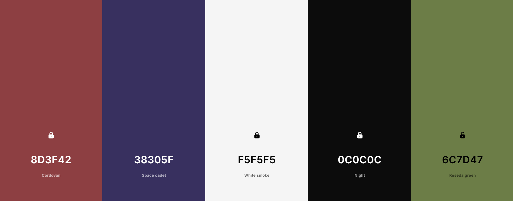
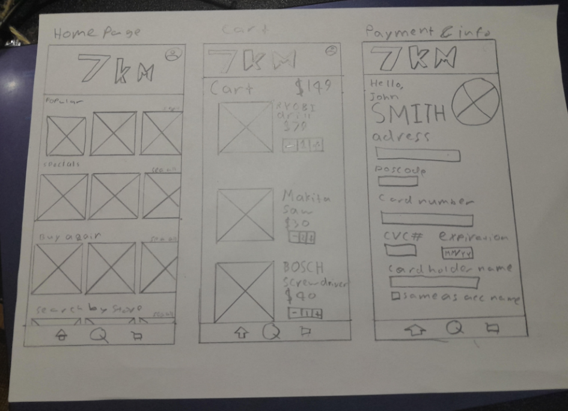
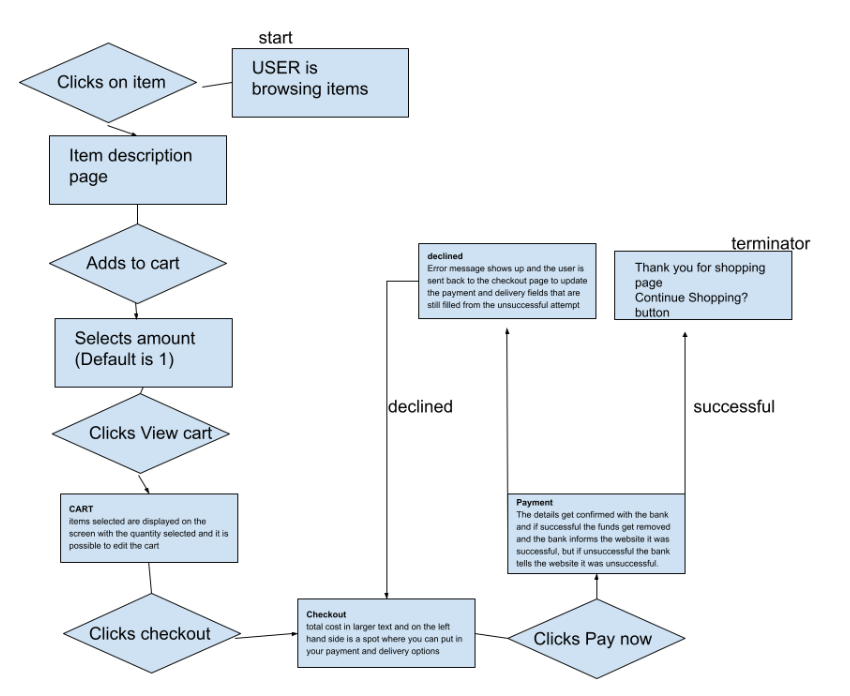
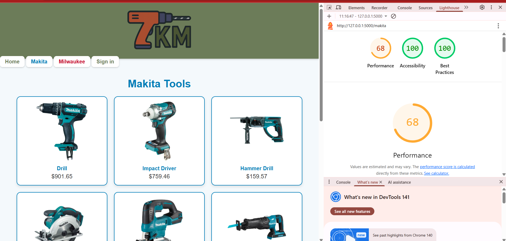

# CPT-folio
## Week 1 Functionality requirements
---
I am going to be creating a web application where you can place an order for equipment or tools, e.g. impact drivers or replacement batteries, and they will be delivered to your door within 30 min. There will be a homepage with recommended tools, recent purchases, specials and popular store pages. There will also be a search page where you can search for specific products and compare and choose identical products from different stores near you. Alternatively you can also search for types of tools and find all of the different ones that are offered and filter by brand, cost, store, ect. There will also be a basket page where you can see and edit all of your items and you can pay which sends you to a form that gets the user’s payment information. There will also be an account and settings page where you can edit the user settings, payment history and see how long your order has until it arrives. 

### Functional Requirements

Users can log in, log out and create a new account 
Users can view and edit their account e.g address, contact information 
Users can view order history and delivery status

Users can view recommended tools, specials, and recent purchases on the homepage 
Users can browse tools by category/type 
Users can search specific tools or brands 
Users can filter products by price, store, brand, power output etc. 
Users can compare identical products across different stores to get the best price *

Users can add or remove products from their cart/baskets 
Users can view and edit the basket; change quantity  
Users can proceed to checkout 
Users can pay by card by filling out a form 
Users can check the estimated remaining delivery time in real time

### Non Functional Requirements

Website should take less than 3 seconds to load 
The website should be able to have many users on it simultaneously without crashing or slowing down 
User data (especially card information) should be stored securely and encrypted and comply with laws relating to data handling* 
The whole website should be simple to use and understand 
The search function should work properly and allow for typos to be made * 
The code should be uncluttered and free of any bugs

*might run out of time for requirements marked with a star*

## Week 2 simple wireframe
---

*This is going to be my prefered colour scheme for my website*

The colours include 
8D3F42 - Cordovan (red) 
38305F - Space Cadet (indigo) 
F5F5F5 - White Smoke 
0C0C0C - Night (black) 
6C7D47 - Reseda Green

*This was my first wireframe that I drew on paper*

I will be using a basic font such as a thick roboto for my subheadings, I would use a  thinner version for the user input appearing on the screen. 
I used cordovan red as one of my main colours as it brings excitement and rush which is something that would benefit us as it is meant to be a quick delivery website. The  reseda Green is mainly used to counter the red and calm the individual down but also maintain an aesthetically pleasing layout. The background colour would probably be a shade of white such as white Smoke White and the text colour would be night black. I will try to include space cadet purple somewhere in the web design, most likely somewhere in the account page.  
I will use images mainly as icons to show the user what they are buying so that they can more easily scroll through the items and not have to read each individual icon. My website design inspiration was a multitude of online stores such as rebel, JB HI FI and amazon. 

## Week 3 Interactive Wirframe
---
[Interactive Figma WIreframe](https://www.figma.com/proto/OnFVapV77fbgHP9KciOt3H/Wireframe-7KM?node-id=0-1&t=n5xVGcwnucpyeyWG-1)

### Logo

*My prompt to get the Logo for Copilot AI:*
Can you make a logo for a  hardware store called 7KM in which the 7 looks like an impact drill. Can the main colours be 8D4F42 and the secondary colour be 6C7D42. can the outline be 0C0C0C and have a little bit of 38305F and F5F5F5

## Week 4 Algorithm Function

### Function description

Function: Adding to cart feature 
User clicks on item 
Chooses quantity 
User clicks add to cart 
The amount of items are added to the cart database 
user continues shopping 
Process repeated until the user clicks proceed to checkout 
The user clicks on the cart icon 
All the items selected are displayed on the screen with the quantity selected 
The user can make some final changes to the cart such as changing the quantity or removing an item, they can also click on the item image or name to see the item page again 
The user clicks the checkout button 
The user gets redirected to checkout payment page where to the right hand side is a summary of all items and the total cost in larger text and on the left hand side is a spot where you can put in your payment and delivery options 
This information is then gets encrypted and sent to the payment gateway which validates the and sends it to the payment processor 
The payment processor communicates with the customer’s bank to verify the transaction and make sure that there is enough money in the account 
The bank either approves or declines the payment and tells the processor which in turn tells the gateway the response 
The gateway tells the website if the order is approved or denied, and the result shows on the screen 
If approved 
The order gets fulfilled and the cart gets emptied 
Sent to a thank you for shopping with us page 
If declined 
The user gets sent back to the checkout page with the information still filled out so that if there were any mistakes made in the process they can be fixed 

### Flowchart analysation

The process is relatively simple and similar to most online store and it can be broken down into 4 main stages: 
**Browsing:** clicks on item > item page 
**Cart:** Adding to cart > select quantity (optional if you want just one) > Viewing cart > editing cart (optional) 
**Checkout:** Enter all information such as payment and delivery > finish by clicking pay now 
**Payment processing:** successful > payment message > back to home | unsuccessful > back to checkout 
My algorithm isn't overly complicated so it should scale well as the business grows and load increases. The backend system should also be optimised so that nothing will break if there is something added to the design.

### Test cases

**Test Case ID:** TC-01 
**Test Cases:** Test cart functionality 
**Preconditions:** User must have a registered account and be logged in to their account, or they can be logged out but they can’t close their tab 
**Test Steps:** 
- Open the website 
- Add several items into the cart with varying quantities 
- Click the cart button 
- Make sure that all the items appear with the correct quantities 

**Expected Result:** The user has all the items in the correct quantity in their cart 
**Actual Result:** all items appear in thier correct quantities in the cart, even if they were to log out and another user logs on in the meantime.  
**Pass/Fail:** Pass 
**Priority:** High

**Test Case ID:** TC-02 
**Test Cases:** Test payment methods 
**Preconditions:** User must have a cart with items and correct and and valid information 
**Test Steps:** 
- Enter checkout page 
- Insert valid card information 
- Click pay now 
- See if the payment has gone through 
- Repeat with invalid information and see if you get redirected back to the checkout page 

**Expected Result:** payment goes through if valid, and redirected back to checkout if invalid 
**Actual Result:** payment works as intended 
**Pass/Fail:** Pass 
**Priority:** medium to high

## Week 5 & 6
- These two weeks I added my SQL database to my program 
- I made three different tables: one had the customer data (name, phone number password and address information), one had the product data (id, price, brand, name, available stock), and order data that has (id, phone number of user, product_id, quantity and date)
- I have used mockaroo to fill my database with sample data

## Week 7
- I Started coding my webpage
- I have connected the code to the link that I can access on my computer to view my website

## Week 8
- I Added my home and sign in page
- I added a banner at the top of each webpage that displays the logo
- I added buttons just underneath the banner for the homepage, sign in page

## Week 9
- I added a link to my sign up page
- I formatted my sign in and sign up page
- I started to add my sign in function but my code is buggy

## Week 10
- I finally got my sign in function to work
- I got the phone number and first name of the user save so the person was actually logged in
- I got a welcome, (name of user) into my banner
- I got a log out functionality

## 1st Week of holidays
- This Week I Designed my home page
- I had at the top of the page an image carousel of some of the products, even thought they were only milwaukee products
- I also added at the bottom two large buttons one for makita and one for Milwaukee that lead to each brand's respective product page
- I made a page for both Makita aand Milwakee that displayed all of the products from their brands
- After clicking on the product you got sent to a product page that of making all of them individually i made a single page that pulls information from my product_data table

## 2nd Week of holidays
- This week I created my online order system. I added a quantity picker button underneath the availability
- When the user clicks the buy now button it decreases the amount available in the product_data database by the desired quantity, and it adds the product along with the quantity and the phone number of the user to the order_data table. the button then turns green and invites the user to update the quantity, or alternatively the user can click on the remove from cart button.
- For every new product a user orders it adds a new row to the database. The benefits of this is that the user can log our, login in as another user, and add to their cart, and their carts would be completely seperate.
- The user can checkout by firsly clicking the cart button. This page displays all of the products linked to the user's phone number and relvant information to the user and shows a total cost and also has buttons to modify or remove the item.
- When the user clicks checkout there is a card informationform, there is no processing of information as it only checks for correct formatting it assumes that the payment went through and the account is real.
- When the user clicks on confirm order and the information is correctly formatted, a new row is created in the invoice table and it inlcludes your phone number, full name, total cost, card information and the date and time of the order confirmation.
- Throughout this process I had issues with bugs, so I used online tools to help me resolve them

## 1st Week of Term 4 / Polishing touches
- On monday I standerdised the banner buttons for all the pages except for the sign in and sign up
- I also made sure that you need to have a unique phone number to make a new account
- After my meeting with Joshua I have made some minor improvements such as labels for the products on the image carousel, as well as ensuring correct formatting for the sign up page, e.g. not having letters in the phone number

## User Instructions
I dont have many instructions as the website is easy to navigate, however I would reccomend signing up and making your own account as you would be redirected there if you try to add items to your cart. From there you should try add a few items, customise the quantity, update the quantity, and remove the items. Furthermoore you should insert incorrectly formatted inputs.

## Acknowledgement 
- I used online resources such as Claude And ChatGPT to help me with debugging, fixing errors and modification of code. I deigned the flow of the website completely by myself, including the relationships with the databases and the inteded use of all of the features, however I used AI to help me the styling.
- I used images from total tools, konnect fastening systems, Amazon, Sydney Tools, Mitre 10, and I used Copilot to generate the image logo.

## Lighthouse Report
